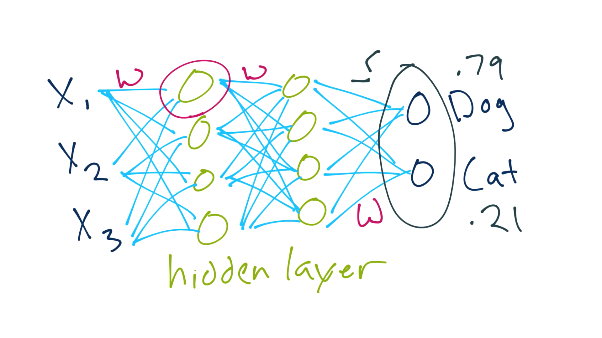
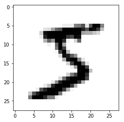
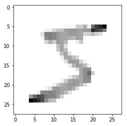

<h1> Introduction to Computer Vision & Deep Learning - The MNIST Dataset </h1>

1. Introduction

MNIST (“Modified National Institute of Standards and Technology”) since its release in 1999, this classic dataset of handwritten images has served as the basis for benchmarking classification algorithms. This project provides a simple approach towards tackling pattern recognition by incorporating some fundamental concepts of Computer Vision. More details about this dataset and the approaches towards it can be found at [The MNIST Database](http://yann.lecun.com/exdb/mnist/index.html)

2. Approach

- Libraries: Tensorflow

We will use the Python deep learning API __Keras__ built on top of Tensorflow to design a 2 hidden layer, Sequential neural network.
  
  



3. Overview

```python
'''
    We will be using the Python deep learning API 'Keras'
    which is built on top of Tensorflow to make it easier for us to
    import our data and design our neural network.
'''

import tensorflow as tf

tf.__version__
```


```python
'''
    Lets load in the MNIST dataset and divide it into training and testing sets
'''
mnist = tf.keras.datasets.mnist
(x_train, y_train), (x_test, y_test) = mnist.load_data()
```


```python
'''
    So basically, our data is going to be an array of pixel intensity values ranging from
    0-255 i.e. from white to black. Lets take a look at a sample record here.
'''

import matplotlib.pyplot as plt

plt.imshow(x_train[0], cmap=plt.cm.binary)
plt.show()
```





```python
'''
    Normalizing our records can lead to significant improvements in performance.
    Although not necessary, it is good practice to normalize the data. Keras has a built-in
    method to normalize data, which give us values ranging from 0-1 without losing the meaning
    of our image data
'''

x_train = tf.keras.utils.normalize(x_train, axis=1)
x_test = tf.keras.utils.normalize(x_test, axis=1)
```


```python
plt.imshow(x_train[0], cmap=plt.cm.binary)
plt.show()
```





```python
'''
    Here we build a simple Sequential model with 2 hidden layers. We need to flatten our input layer
    because we need to have linear relations between our first and second layer. Our hidden layers will
    have 128 neurons with a rectified linear activation function which determine whether or not the neurons will
    fire or activate
'''


model = tf.keras.models.Sequential()
model.add(tf.keras.layers.Flatten())
model.add(tf.keras.layers.Dense(128, activation=tf.nn.relu))
model.add(tf.keras.layers.Dense(128, activation=tf.nn.relu))
model.add(tf.keras.layers.Dense(10, activation=tf.nn.softmax))
```


```python
model.compile(optimizer='adam',
             loss='sparse_categorical_crossentropy',
             metrics=['accuracy'])
model.fit(x_train, y_train, epochs=3)
```

    Epoch 1/3
    60000/60000 [==============================] - 32s 531us/step - loss: 0.2626 - acc: 0.9221
    Epoch 2/3
    60000/60000 [==============================] - 11s 178us/step - loss: 0.1055 - acc: 0.9674
    Epoch 3/3
    60000/60000 [==============================] - 10s 169us/step - loss: 0.0713 - acc: 0.9771
    


    <tensorflow.python.keras.callbacks.History at 0x1fd78b15898>


```python
val_loss, val_acc = model.evaluate(x_test, y_test)
print(val_loss, val_acc)
```

    10000/10000 [==============================] - 1s 127us/step
    0.09169565073102713 0.9706
    


```python
'''
    One thing about neural networks is that they tend to fit to the training data pretty nicely.
    But we need to make sure we do not overfit our model to only work well with our in-sample data.
    As we can see our model performs well with out of sample data with 97% accuracy
'''
```